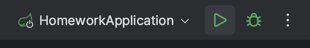
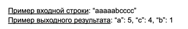
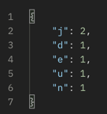

# Документация тестового задания

## Запуск приложения

* Осуществляется путем запуска файла HomeworkApplication

---

## Входные и выходные параметры

* На вход приложения допускается только последовательность букв любого алфавита, не содержищие разделителей и других символов

* На выходе программа выдает JSON с отсортированным по убыванию количеством вхождений символов в заданную строку

---
Запуск приложения:  
  
 
Описание входных и выходных данных из ТЗ:  
  
 
Пример http-запроса:  
  
 
Пример JSON-ответа:  

